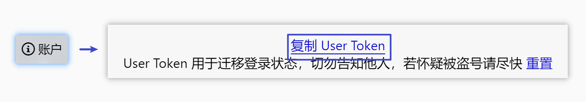
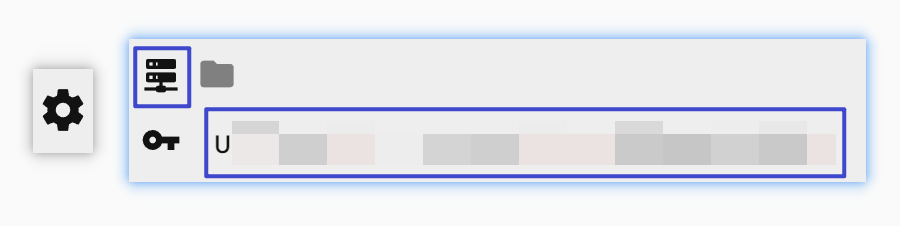
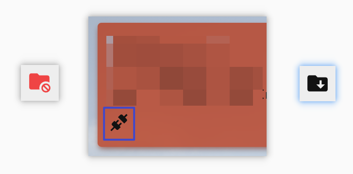

# Amaranthine

一个用于树洞关注列表备份的工具。

## 用户协议

1. 您同意使用本工具时，您仍然需要遵守 [PKU Helper网络服务“P大树洞”管理规范](https://pkuhelper.pku.edu.cn/treehole_rules.html)除第五条第三款外的全部内容。特别地，您必须遵守第五条第四款：
  > 不得擅自将 P 大树洞内容向北京大学校外人员或 PKU Helper 用户以外的用户传播。
2. 您同意：您不遵守树洞管理规范或其他相关校规、法律法规，或错误使用工具所导致的一切后果由您自行承担。
3. 使用本工具代表您同意 Microanalytics 收集您的浏览器、地址、设备等信息。您的 User Token、关注列表等树洞内容的信息**不会被收集**。[统计数据](https://microanalytics.io/amaranthine.vercel.app)完全公开。
4. 本工具源代码以 MIT 许可证发布，背景图片除外。使用源代码需要遵守许可证。

## 教程

请不要在微信浏览器中打开 Amaranthine，不能保证在微信浏览器中正常工作，你可以选择“在其他浏览器中打开”。移动端和桌面端的现代浏览器皆可。

首先，登录官方网页版树洞，复制 User Token。

在 Amaranthine 右下角打开设置界面，点击服务器图标，粘贴 User Token 到文本框内。

将自动开始加载树洞和回复。当右下角的文件夹图标显示为红色且带禁止符号，说明部分树洞的回复加载失败。可以向下滚动屏幕尝试自动加载，同时可以点击每一条树洞下方的链接断开图标手动加载，而**不要刷新网页**。当所有回复全部加载完成后，右下角文件夹图标还原为正常颜色，并显示下载符号。

点击该文件夹图标，可以将树洞和回复保存为 JSON 文件，下载到本地。**图片不会被备份**。之后，在右下角打开设置，点击文件夹图标，再点上传图标，选择你的备份文件。

每次上传后，你的备份文件会被缓存在浏览器中。再次打开时无需重新上传，会自动加载备份中的关注列表。

## 隐私

### 我的 User Token / 树洞关注列表是否会被泄露？

你的 User Token 存在你的浏览器中，Amaranthine 的作者不能获取到你的 User Token，也不能获取到你的关注列表。你可以通过检查源代码确认这一点。事实上 Amaranthine 没有后端服务器，是纯前端的网页应用。

你需要自行保证你在本地备份的 JSON 的文件的安全。

### Amaranthine 会意外取关 / 关注 / 发树洞吗？

不会。代码中完全没有相关的逻辑，只向树洞服务端发送 GET 请求。

### 我访问 Amaranthine 的数据会被记录吗？

会。我们使用 Microanalytics 统计访问数据。它会记录您的使用设备、浏览器和所在地信息。[统计数据](https://microanalytics.io/amaranthine.vercel.app)完全公开。

Amaranthine 托管在 Vercel 服务器上，您的访问数据可能被 Vercel 记录，请知悉。

## 版权

部分背景图片来自 ©蔡翔宇，原作者保留一切权利。
